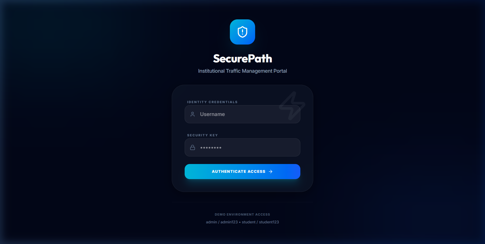
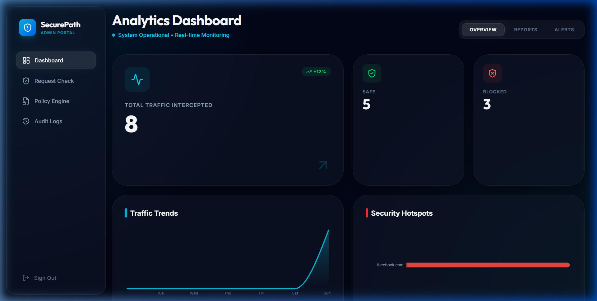
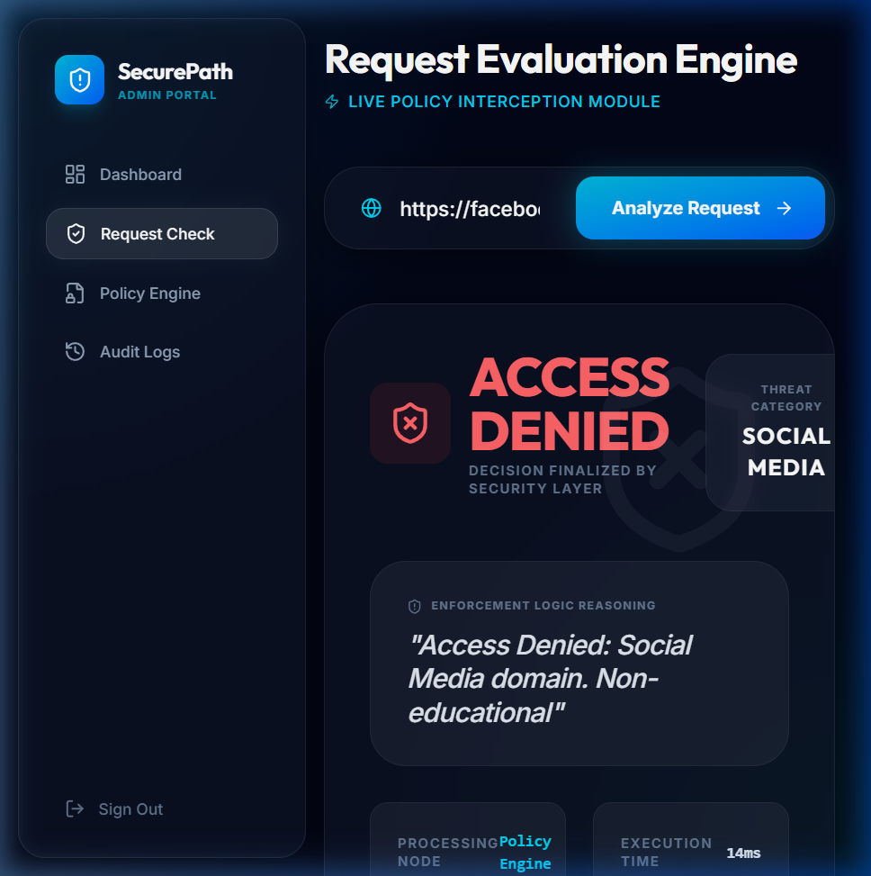
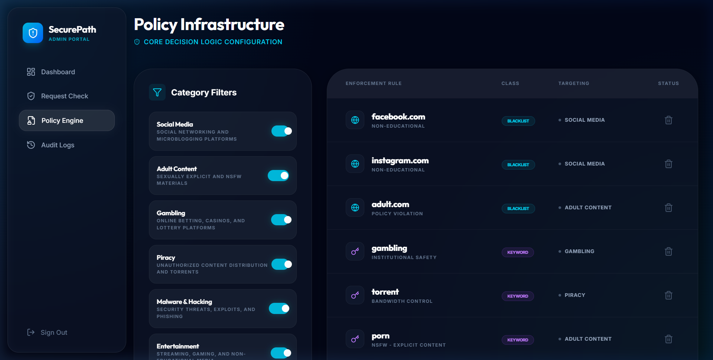
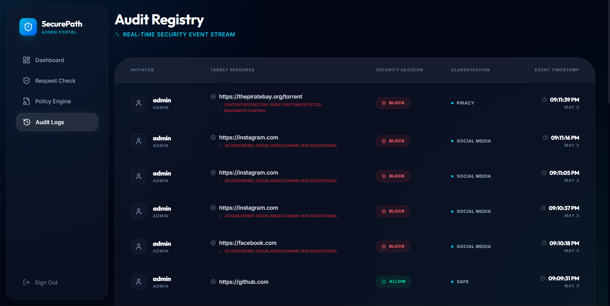

# SecurePath: Advanced Institutional Traffic Management & Policy Enforcement 🛡️

[](https://fastapi.tiangolo.com/)
[](https://reactjs.org/)
[](https://www.mongodb.com/)
[](https://tailwindcss.com/)

**SecurePath** is a production-grade digital wellbeing and security portal designed for institutional environments (Schools, Universities, Corporate Offices). It provides a high-performance, asynchronous interception layer that evaluates web traffic against complex security policies in sub-millisecond time.

---

## 🏛️ Architectural Overview

SecurePath operates on a **Three-Tier Architecture** optimized for low-latency decision making:

1.  **Interception Layer (Simulation)**: A high-fidelity module that simulates real-world request capture from proxies or browser extensions.
2.  **Stateful Policy Engine**: An asynchronous decision logic layer that utilizes in-memory caching to evaluate requests against thousands of rules without DB bottlenecks.
3.  **Command & Control (C2) Dashboard**: A premium administrator interface for real-time monitoring, pattern analysis, and global policy deployment.

---

## ✨ Core Innovation & Features

### 💎 Premium User Experience
Built with a **Linear-style** dark aesthetic, the interface utilizes:
*   **Bento Grid Analytics**: High-density data visualization using Recharts.
*   **Glassmorphism**: A cohesive visual language with 16px blur depth and subtle borders.
*   **Staggered Animations**: Framer Motion powered transitions for a fluid, reactive feel.

### 🛡️ Multi-Layered Security Engine
*   **Blacklist Enforcement**: Domain-level blocking for known malicious or restricted sites.
*   **Content-Based Keyword Filtering**: Real-time evaluation of URL parameters and search queries.
*   **Global Category Toggles**: Instant activation/deactivation of entire content classes (e.g., Social Media, Gambling).

### 📊 Audit & Intelligence
*   **Real-time Event Streaming**: A high-fidelity audit registry tracking every decision with detailed rationale.
*   **Security Hotspot Mapping**: Identification of frequent policy violators and high-risk domains.

---

## 🚀 Getting Started

### 📦 Installation

**1. Clone the Repository**
```bash
git clone https://github.com/yourusername/SecurePath.git
cd SecurePath
```

**2. Backend Configuration**
```bash
cd backend
python -m venv .venv
# Windows
.\.venv\Scripts\activate
# Linux/Mac
source .venv/bin/activate
pip install -r requirements.txt
uvicorn main:app --reload
```

**3. Frontend Configuration**
```bash
cd frontend
npm install
npm run dev
```

### 🧪 Database Seeding
To initialize the system with professional security policies, run:
```bash
python backend/scripts/seed_policies.py
```

---

## 📸 Interface Preview

<div align="center">
  
  
</div>
<div align="center">
  
  
</div>
<div align="center">
  
</div>

---

## 🧪 System Validation Results

A comprehensive test was conducted using the **Request Evaluation Engine** with 10 representative URLs to verify the integrity of the filtering layers.

| URL | Category | Expected | Result | Security Logic Applied |
| :--- | :--- | :--- | :--- | :--- |
| `google.com` | Safe | ALLOW | ✅ PASSED | Domain Trust Verification |
| `wikipedia.org` | Education | ALLOW | ✅ PASSED | Educational Exception Rule |
| `github.com` | Developer | ALLOW | ✅ PASSED | Verified Developer Domain |
| `khanacademy.org` | Education | ALLOW | ✅ PASSED | Trusted Institutional Provider |
| `stackoverflow.com` | Developer | ALLOW | ✅ PASSED | Verified Knowledge Base |
| `facebook.com` | Social Media | BLOCK | ❌ BLOCKED | Blacklist Layer Enforcement |
| `instagram.com` | Social Media | BLOCK | ❌ BLOCKED | Blacklist Layer Enforcement |
| `adult.com` | Adult | BLOCK | ❌ BLOCKED | Global Category Restriction |
| `gambling.com` | Gambling | BLOCK | ❌ BLOCKED | Keyword Pattern Matching |
| `piratebay.org` | Piracy | BLOCK | ❌ BLOCKED | Smart Policy Layer |

---

---

## 🔑 Access Credentials
| Role | Username | Password |
| :--- | :--- | :--- |
| **Administrator** | `admin` | `admin123` |
| **Student** | `student` | `student123` |

---

## ⚖️ License & Credits
Developed as a Final Year MCA Capstone Project. 
Distributed under the **MIT License**.

---
<div align="center">
  <sub>Built with ❤️ for SecurePath | v1.0.0</sub>
</div>
